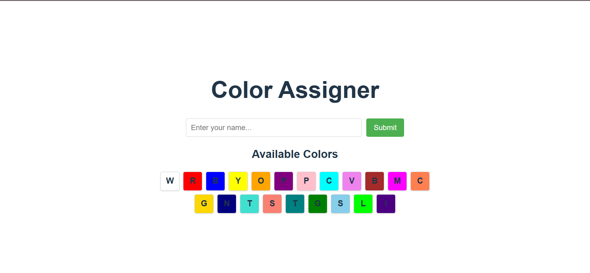
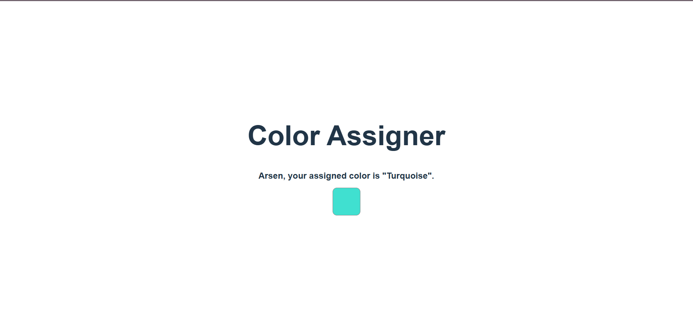

# Color Assigner App

Enter your name and get assigned a color. The app uses [*Google Sheets*](https://docs.google.com/spreadsheets/d/1JiGNDzP4BbRDY-fgwYg-dhldLHFYzI7PulDO-qN0Jhk/edit?gid=0#gid=0) as a mini backend, there we have 2 sheets:

 1) Participants
 2) Available Colors

*Apps Script* is used for accessing the sheets with apis.

## Screenshots

### Home Page

### Assigned Color

## Deployment

The app is deployed and accessible with Netlify [here](https://mutafyan-color-assigner.netlify.app/)
